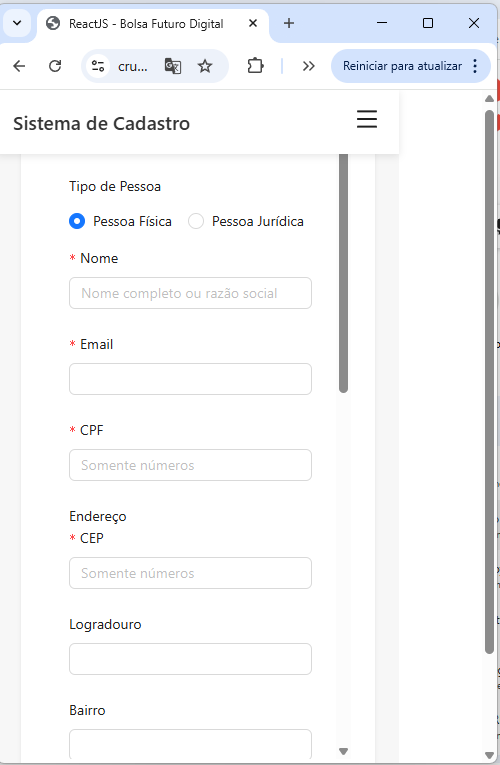
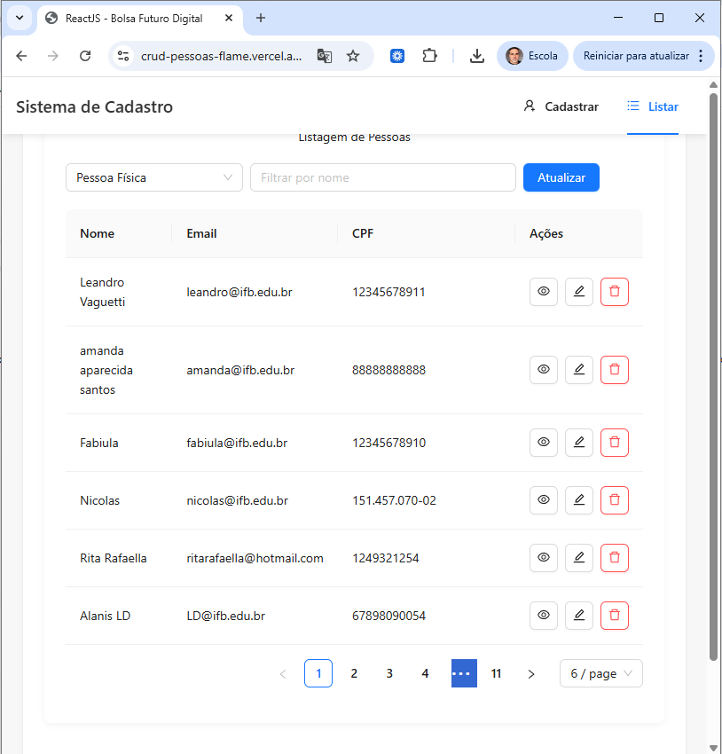
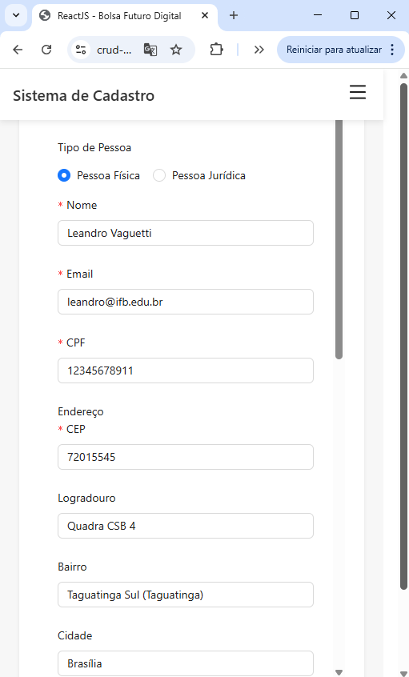

# 🚀 Projeto FrontEnd — CRUD de Pessoas (PF e PJ)

Aplicação FrontEnd desenvolvida em **ReactJS** para gerenciamento de **Pessoas Físicas (PF)** e **Pessoas Jurídicas (PJ)**, implementando **CRUDs completos**, **relacionamentos entre entidades** e integração com **API REST**, conforme desafios propostos no contexto do **Bolsa Futuro Digital (BFD)**.

---

## 🌐 Deploy da Aplicação

- 🔗 **FrontEnd (produção):**  
  https://crud-pessoas-flame.vercel.app/

- 🔗 **BackEnd (API REST):**  
  https://backend-pessoas.vercel.app/

---

## 📦 Repositórios do Projeto

- 🔗 **FrontEnd (ReactJS):**  
  https://github.com/vaguettibfd/ReactJSBFD

- 🔗 **BackEnd (Node.js + Express + MongoDB):**  
  https://github.com/vaguettibfd/backend_pessoas

---

## 🧭 Visão Geral do Projeto

- **Domínio:** Gerenciamento de Pessoas  
- **Entidades principais:** Pessoa, PF, PJ, Conta, Endereço, Telefone e Título  
- **Objetivo:** Desenvolver uma aplicação FrontEnd completa, com consumo de API REST, CRUDs funcionais e aplicação de boas práticas de organização e arquitetura.  
- **Persistência:** Realizada via **Backend (API REST)**.  

---

## 🧰 Tecnologias Utilizadas

### FrontEnd
- ReactJS  
- JavaScript (ES6+)  
- Ant Design (AntD)  
- React Router  
- Fetch API / Axios  

### BackEnd (Integração)
- Node.js  
- Express  
- MongoDB (Mongoose)  
- API REST  
- Deploy em Vercel  

---

# 🎯 Desafio Atendido (CRUDs + Relacionamentos)

O projeto atende integralmente ao desafio proposto, contemplando:

- ✅ CRUD de Pessoas Físicas (PF)  
- ✅ CRUD de Pessoas Jurídicas (PJ)  
- ✅ Relacionamentos entre Pessoa, Endereço, Telefone, Conta e Título  
- ✅ Uso de API REST para persistência  

---

## 📋 Requisitos Funcionais (RF)

### Pessoa Física (PF)
- RF01 — Cadastrar Pessoa Física  
- RF02 — Listar Pessoas Físicas  
- RF03 — Visualizar detalhes da Pessoa Física  
- RF04 — Editar Pessoa Física  
- RF05 — Remover Pessoa Física  
- RF06 — Associar Endereço, Telefones e Título Eleitoral  

### Pessoa Jurídica (PJ)
- RF07 — Cadastrar Pessoa Jurídica  
- RF08 — Listar Pessoas Jurídicas  
- RF09 — Editar Pessoa Jurídica  
- RF10 — Remover Pessoa Jurídica  
- RF11 — Associar filiais  

---

## ⚙️ Requisitos Não Funcionais (RNF)

- RNF01 — Aplicação desenvolvida em ReactJS  
- RNF02 — Interface construída com Ant Design  
- RNF03 — Comunicação com Backend via API REST  
- RNF04 — Uso do padrão DAO para acesso aos dados  
- RNF05 — Interface responsiva  
- RNF06 — Validação de formulários  
- RNF07 — Código organizado por componentes e responsabilidades  

---

# 🖼️ Telas da Aplicação

As telas abaixo ilustram as principais funcionalidades do sistema.

### Tela 1 — Cadastro de Pessoa


### Tela 2 — Menu de Navegação


### Tela 3 — Listagem de Pessoas


### Tela 4 — Visualização de Pessoa Física


### Tela 5 — Alteração de Dados


---

# 🧠 Modelagem dos Dados

## 📌 Diagrama de Classes

O diagrama de classes abaixo representa o modelo conceitual utilizado no projeto, servindo como base para o Backend e para o consumo no FrontEnd.


O diagrama foi modelado utilizando **PlantUML**, conforme o arquivo `uml6.txt`.

---

## 🔗 Integração com Backend

- **API Base:**  
  https://backend-pessoas.vercel.app/

- **Operações utilizadas:**
  - GET — Listagem  
  - POST — Cadastro  
  - PUT — Atualização  
  - DELETE — Remoção  

---

## 📂 Estrutura do Projeto FrontEnd

```bash
src/
├── pages/
├── components/
├── models/
├── daos/
├── services/
├── routes/
└── App.jsx
```

---

## ▶️ Execução Local

```bash
npm install
npm run dev
```

---

## 👥 Autoria

- **Autor:** Leandro Vaguetti  
- **Projeto:** Bolsa Futuro Digital (BFD)  
- **Área:** Desenvolvimento FrontEnd  
- **Instituição:** Instituto Federal de Brasília (IFB)

---

## 📌 Considerações Finais

Este projeto demonstra:
- domínio dos conceitos de CRUD;
- integração FrontEnd ↔ BackEnd via API REST;
- aplicação de modelagem UML;
- aplicação publicada em ambiente de produção.

