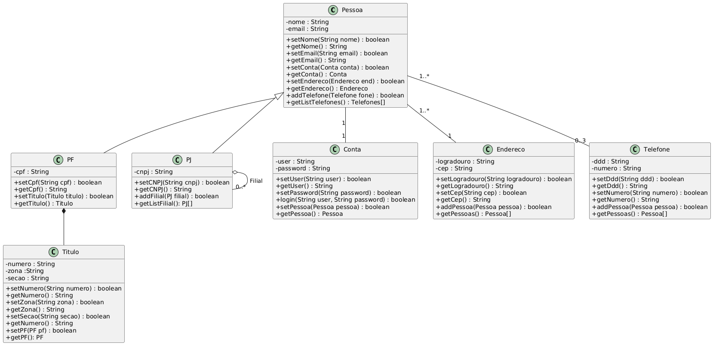

# 🚀 Projeto FrontEnd — CRUD de Pessoas (PF e PJ)

Aplicação FrontEnd desenvolvida em **ReactJS** para gerenciamento de **Pessoas Físicas (PF)** e **Pessoas Jurídicas (PJ)**, implementando **CRUDs completos**, **relacionamentos entre entidades** e integração com **API REST**, conforme desafios propostos na disciplina de FrontEnd.

---

## 🌐 Deploy da Aplicação

- 🔗 **FrontEnd (produção):**  
  https://crud-pessoas-flame.vercel.app/

- 🔗 **BackEnd (API REST):**  
  https://backend-pessoas.vercel.app/

---

## 📦 Repositórios do Projeto

- 🔗 **FrontEnd (ReactJS):**  
  https://github.com/vaguettibfd/ReactJSBFD

- 🔗 **BackEnd (Node.js + Express + MongoDB):**  
  https://github.com/vaguettibfd/backend_pessoas

---

## 🧭 Visão Geral do Projeto

- **Domínio:** Gerenciamento de Pessoas  
- **Entidades principais:** Pessoa, PF, PJ, Conta, Endereço, Telefone e Título  
- **Objetivo:** Aplicar conceitos de FrontEnd com ReactJS, consumo de API REST, CRUDs completos, organização por componentes e uso do padrão DAO  
- **Persistência:** Dados armazenados e gerenciados via **Backend (API REST)**  

---

## 🧰 Tecnologias Utilizadas

### FrontEnd
- ReactJS
- JavaScript (ES6+)
- Ant Design (AntD)
- React Router
- Fetch API / Axios

### BackEnd (Integração)
- Node.js
- Express
- MongoDB (Mongoose)
- API REST
- Deploy em Vercel

---

# 🎯 Desafio Atendido (CRUDs + Relacionamentos)

Este projeto atende ao desafio proposto, implementando:

- ✅ **CRUD de Pessoas Físicas (PF)**
- ✅ **CRUD de Pessoas Jurídicas (PJ)**
- ✅ **CRUD de Endereços e Telefones (relacionamentos)**
- ✅ **Relacionamentos 1:1, 1:N e N:N**
- ✅ **Persistência via API REST**

---

## 📋 Requisitos Funcionais (RF)

### CRUD — Pessoa Física (PF)
- RF01 — Cadastrar Pessoa Física
- RF02 — Listar Pessoas Físicas
- RF03 — Editar Pessoa Física
- RF04 — Remover Pessoa Física
- RF05 — Associar Título Eleitoral à PF

### CRUD — Pessoa Jurídica (PJ)
- RF06 — Cadastrar Pessoa Jurídica
- RF07 — Listar Pessoas Jurídicas
- RF08 — Editar Pessoa Jurídica
- RF09 — Remover Pessoa Jurídica
- RF10 — Associar filiais à PJ

### Endereço e Telefone
- RF11 — Cadastrar Endereço
- RF12 — Associar Endereço a Pessoas
- RF13 — Cadastrar Telefones
- RF14 — Associar até 3 Telefones por Pessoa

### Conta
- RF15 — Criar Conta vinculada à Pessoa
- RF16 — Realizar login utilizando Conta

---

## ⚙️ Requisitos Não Funcionais (RNF)

- RNF01 — Aplicação desenvolvida em ReactJS
- RNF02 — Interface construída com Ant Design
- RNF03 — Comunicação com Backend via API REST
- RNF04 — Uso de DAOs para encapsular operações de dados
- RNF05 — Interface responsiva
- RNF06 — Validação de formulários
- RNF07 — Código organizado por componentes e responsabilidades

---

# 🧠 Modelagem dos Dados

## 📌 Diagrama de Classes

O diagrama abaixo representa as **classes persistentes do domínio**, utilizado como base tanto para o **Backend** quanto para o **consumo no FrontEnd**.



---

## 🔗 Integração com Backend

- **API Base:**  
  https://backend-pessoas.vercel.app/

- **Principais operações utilizadas pelo FrontEnd:**
  - GET — Listagem de PF e PJ
  - POST — Cadastro de PF e PJ
  - PUT — Atualização de registros
  - DELETE — Remoção de registros

---

## 📂 Estrutura do Projeto FrontEnd

```bash
src/
├── pages/
├── components/
├── models/
├── daos/
├── services/
├── routes/
└── App.jsx
```

---

## ▶️ Execução Local

```bash
npm install
npm run dev
```

---

## 👥 Autoria

- **Autor:** Leandro Vaguetti  
- **Curso:** Análise e Desenvolvimento de Sistemas / Ciência da Computação  
- **Disciplina:** FrontEnd  
- **Instituição:** Instituto Federal de Brasília (IFB)

---

## 📌 Considerações Finais

Este projeto:
- implementa **CRUDs completos**;
- utiliza **API REST** para persistência;
- aplica **modelagem UML** documentada;
- está **publicado em produção (FrontEnd e BackEnd)**;
- segue boas práticas de organização e arquitetura.


